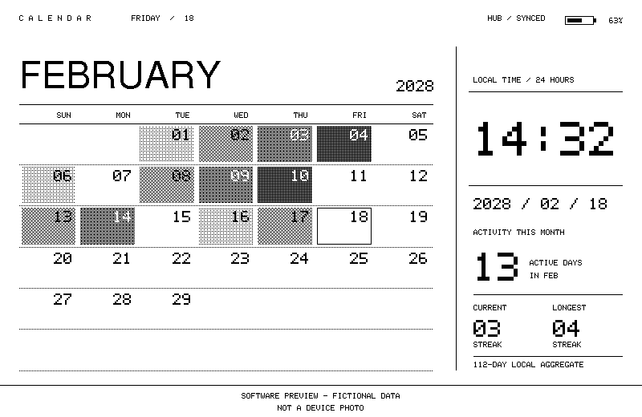
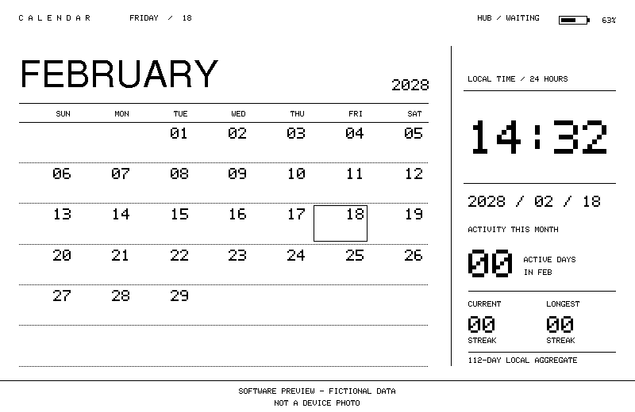

# PaperMono Calendar

M5Stack PaperMono（C153）的横屏电子日历：月历、点阵数字时钟、电量，以及融入日期格的 Codex 活跃度。



> 根据当前固件绘制函数离线生成的**软件预览，非设备实拍**。日期、时间、电量及活动统计全部为虚构样例；底部两行标注不属于设备 UI。查看[其他状态、配图来源及复现方法](docs/interface.md)。

这是从实际设备项目中整理的**固件仓库**，不是完整的 Mac Hub App。无 Hub 时仍可显示 RTC 日历和时钟；活动数据和自动校时需要兼容的 BLE 主机。

## 页面与行为

- 800×480 横屏，左侧完整月历，日期数字统一右上对齐。
- 今天使用矩形轮廓、不显示活动底纹；其他日期使用四档黑白点阵密度模拟灰度，不使用纯黑实心最高档。
- 右侧显示 `HH:MM`、`YYYY / MM / DD`、本月活跃天数及当前/最长连续天数。
- 顶部显示电量和 `HUB / …` 状态；不显示秒，不做装饰动画，前光默认关闭。
- 先在 PSRAM 画布绘制，再推送屏幕；分钟变化通常只更新时间区域。

**活动强度按 turns（任务轮次）统计，不是 token、金额、每日额度或消耗百分比。** 没有底纹也可能是未同步、日期超出 112 天窗口，或今天被有意留白。

### 等待 Hub 的界面



等待状态仍显示 RTC 日历与时钟；零统计表示尚未加载活动，不能据此断言实际没有活动。图中保留的日期时间也是虚构示例，并不证明该设备当前 RTC 准确。

## 当前验证边界

- v2 活动同步及 `HUB / SYNCED` 已在 PaperMono 上确认；`YYYY / MM / DD` 已由使用者确认。
- v3 增加 Hub 本地时间校准 RTC，已完成编译和烧录；实际时钟校准仍待设备验收，不能仅凭主机发送日志视为成功。
- 当前显示实现仍是 **Arduino / M5GFX 过渡版**。已实现应用层“10 次 text 更新后，下次更新使用 quality”的计数策略，**不等于已实现或验证官方 OTP 驱动完整状态机**。详见 [刷新约束](REFRESH_POLICY.md)。

## 快速开始

仅适用于已验证的 **PaperMono C153 / ESP32-S3 / 16MB Flash / 8MB PSRAM**。不要烧录到 M5Paper、PaperS3 或其他 ESP32-S3 产品。

安装 [Arduino CLI](https://docs.arduino.cc/arduino-cli/installation/)（本项目验证版本 `1.4.1`），然后在此仓库根目录运行：

```sh
# 下载固定版本的板卡包和库；会修改 Arduino CLI 配置的数据目录。
sh tools/setup.sh
sh tools/compile.sh
```

也可用 `ARDUINO_CLI=/path/to/arduino-cli` 指定可执行文件。无需相邻的 M5StackChan 项目或复制其工具缓存。

依赖固定为 M5Stack ESP32 `3.3.9`、M5Unified `0.2.21`、M5GFX `0.2.28`、M5PM1 `1.0.7` 和 M5IOE1 `1.0.9`。编译/上传共用 [board 配置](tools/common.sh)，产物输出到被忽略的 `build/`。

### 安全烧录

烧录会覆盖应用固件。确认设备、端口和固件来源；需要保留的原固件请先备份，勿执行整片擦除。

```sh
arduino-cli board list
# 必须替换为实际确认的 PaperMono 端口。
sh tools/upload.sh /dev/cu.usbmodemXXXX
```

`upload.sh` 只上传 `build/` 的产物，不自动编译；源码修改后须重新编译。克隆目录应保持 `PaperMonoCalendar`，以符合 Arduino 同名 sketch 规则。Windows 环境未实测。

## Hub 同步

PaperMono 主动扫描 `StackChanCodex` 名称或服务 UUID，连接后读取 Activity 特征；成功后每小时同步，失败每分钟重试。未变化的数据不使月历变脏。

- [BLE v2/v3 字节协议、CRC 和安全边界](docs/protocol.md)
- [与现有 macOS M5StackHub 集成](docs/hub-integration.md)
- [排障与验收步骤](docs/troubleshooting.md)
- [构建和设备验证记录](docs/verification.md)

Hub 当前允许普通 BLE 读取活动统计；附近设备可能读取汇总信息。PaperMono 客户端仍主动请求加密，但这**不是**对其他客户端的访问控制。请先阅读协议文档中的隐私说明。

## 开发与检查

```sh
# 使用 Python 标准库和本机 C++17 编译器，测试实际固件中的解码函数。
python3 -m unittest discover -s tests -v
sh tools/compile.sh
```

测试全部使用合成数据，不扫描 Codex 会话、不访问蓝牙，也不烧录设备。GitHub Actions 配置会运行同样的协议测试及固件编译；首次线上结果以仓库 Actions 为准。

## 文件与发布范围

```text
PaperMonoCalendar.ino    固件：UI、BLE、RTC、刷新调度
tools/                  固定配置、依赖安装、编译和上传
docs/                   协议、Hub 集成、排障和验证记录
docs/images/            两种状态的软件预览与字体声明
tools/render_previews.py 从现有绘制函数生成配图（只用虚构数据）
tests/                  合成数据协议、脚本和配图检查
REFRESH_POLICY.md       后续显示开发的 OTP 规范与当前差距
.github/workflows/      编译、协议测试及配图复现校验
```

不包含完整 Hub App、实际活动记录、提示词、会话标题、设备 Flash/NVS 备份、配对记录、账号凭据、本机路径、构建缓存或含真实统计的历史设计稿。第三方库由构建工具安装，不复制进仓库。本次未擅自添加开源许可证，后续授权方式由仓库所有者决定。
